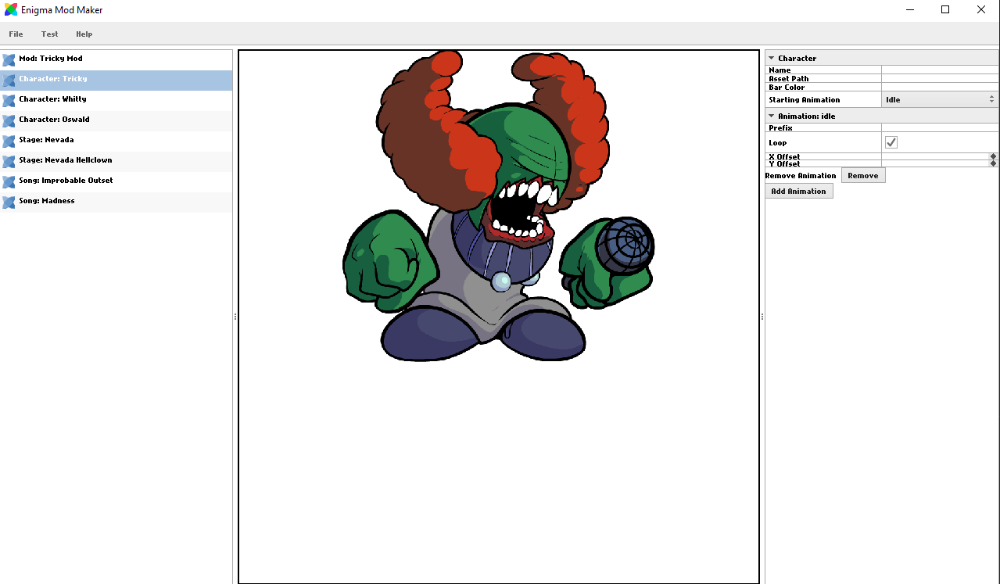

# Enigma Mod Maker for Friday Night Funkin'



The Enigma Mod Maker is a tool for Friday Night Funkin' designed to allow users to create basic Friday Night Funkin' mods with no coding knowledge. It allows you to create or import custom characters, custom songs, custom stages, and custom weeks using an intuitive graphical interface.

The mods created by Enigma Mod Maker are designed to be used with [Enigma Engine](https://enigmaengine.github.io/).

Enigma Mod Maker is powered by HaxeUI and designed for Windows, Mac, and Linux computers.

## Using Enigma Mod Maker

[Click here] to download the latest release of Enigma Mod Maker.

## Compiling 

To compile Enigma Mod Maker from source, follow these steps:

1. Download necessary dependencies:
  - [Haxe (latest version)](https://haxe.org/download/)
  - Visual Studio Code
2. Clone the repository and open it in VSCode. When you do, you will be prompted to install several recommended extensions.
  - When cloning the repository, make sure to download all submodules.
4. Run the following commands in your terminal to install necessary dependencies:
```
haxelib install lime
haxelib install openfl
haxelib install flixel
haxelib install flixel-addons
haxelib install flixel-ui
haxelib install hxcpp
haxelib install hxWidgets
haxelib install haxeui-core
haxelib install haxeui-flixel
haxelib install haxeui-hxwidgets
haxelib install haxeui-rich-text
haxelib git polymod https://github.com/MasterEric/PolyMod
```
4. Run the following additional setup commands:
```
haxe hxwidgets.hxml
```
5. To perform a debug build with breakpoint support, press F5.
6. To perform a release build, run `lime build <platform>`. `<platform>` can be `windows`, `mac`, or `linux`.

## Licensing

Enigma Mod Maker is open-source copyleft software, and any modifications to it must also be made open source under the GNU GPLv3 license.
